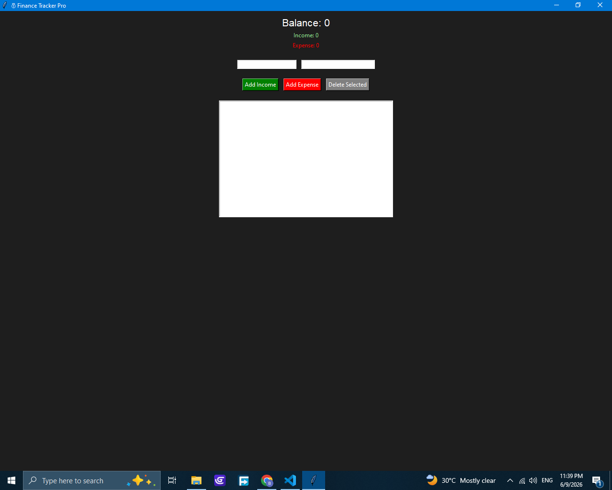
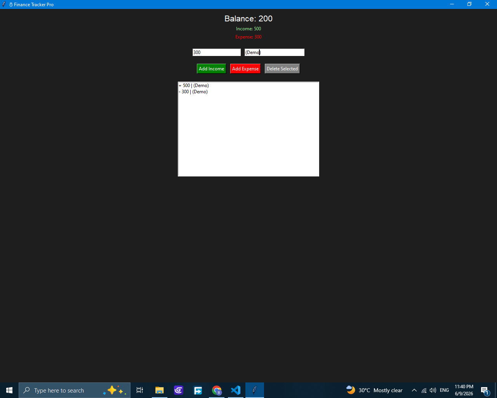

# Finance Tracker Pro

A desktop finance tracking application built with Python, Tkinter, and JSON.

## How to Use

1. Open FinanceTracker.exe
2. Enter amount and description
3. Click Income or Expense
4. Select transaction and delete if needed
5. Data saves automatically

## Features

- Income & Expense tracking
- Balance calculation
- Transaction history
- Delete feature
- Auto-save system

## Screenshots

### Main Dashboard

### Transaction History

